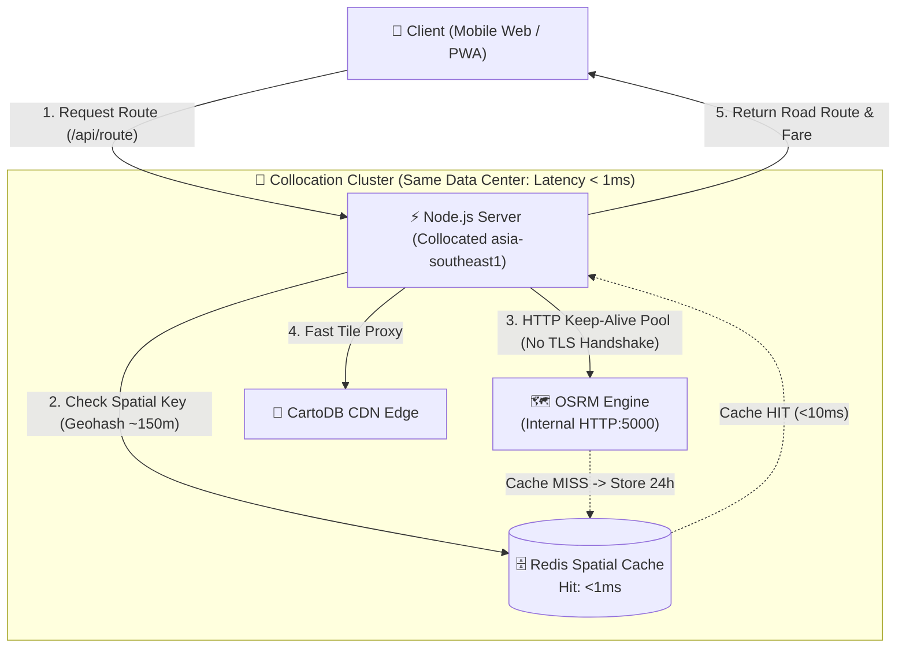

# 🚀 RideCheck Caching & Infrastructure Optimization Guide

เอกสารคู่มือสถาปัตยกรรมโครงสร้างพื้นฐานและการปรับแต่งความเร็วระดับ Enterprise ของ **RideCheck Thailand** 

---

## 📌 สรุป 3 เสาหลักด้าน Performance & Caching

---

### 1. 🗄️ Redis Spatial Cache (ตอบกลับในระดับ <10ms)
- **หลักการทำงาน:**
  - แปลงพิกัดละติจูด/ลองจิจูดของจุดรับและจุดส่ง (Origin & Destination) ให้เป็น **Geo-hash Base32** (ความละเอียด 7 หลัก $\approx 150 \times 150$ เมตร)
  - รูปแบบคีย์: `rc:route:v1:{originGeohash}_{destGeohash}` (เช่น `rc:route:v1:w4rqqbr_w4rqpwr`)
  - เมื่อมีผู้ใช้ค้นหาเส้นทางเดิมหรือบริเวณใกล้เคียง (~150m) ระบบจะดึงผลลัพธ์จากแคชทันทีโดยไม่ต้องคำนวณซ้ำ
- **ความเร็ว (Latency):**
  - **In-Memory Spatial LRU Fallback:** `< 1ms`
  - **Local/Regional Redis:** `< 3ms`
  - ประหยัดเวลาการต่อออกไปยังต่างประเทศได้กว่า **95%**
- **ไฟล์ที่เกี่ยวข้อง:**
  - [spatial-cache.js](file:///d:/ridecheck-main/spatial-cache.js): ตัวคำนวณ Geohash, In-Memory LRU Cache, และ Redis Client Manager
  - [server.js](file:///d:/ridecheck-main/server.js): API Endpoint `/api/route` และ `/api/cache/stats`

---

### 2. 🏢 Collocation (วางเซิร์ฟเวอร์ไว้ใน Region เดียวกัน)
- **ปัญหาเดิม:** Node.js อยู่ที่หนึ่ง, OSRM Public อยู่ที่เยอรมนี/ยุโรป ทำให้มีค่า Network RTT ข้ามทวีป 300–600ms ทุกคำขอ
- **การแก้ไข:**
  - ย้าย Node.js, OSRM Server และ Redis ให้เข้ามาอยู่ใน Data Center / Region เดียวกัน: **`asia-southeast1` (สิงคโปร์ / ไทย IDC)**
  - การสื่อสารระหว่างเซอร์วิสจะวิ่งผ่าน **Internal Private Network (VPC Bridge)** ทำให้ Latency เหลือ **< 1ms**
- **ไฟล์คอนฟิก:**
  - [docker-compose.yml](file:///d:/ridecheck-main/docker-compose.yml): เชื่อมต่อทั้ง 3 คอนเทนเนอร์บน Network เดียวกัน (`ridecheck-collocation-net`)
  - [.env.example](file:///d:/ridecheck-main/.env.example): ตัวอย่างการตั้งค่า Environment Variables สำหรับ Production

---

### 3. ⚡ HTTP Keep-Alive & Persistent Connection Pooling
- **ปัญหาเดิม:** ทุกครั้งที่ Node.js ติดต่อไปยัง OSRM, Geocoding API, หรือ CartoDB จะต้องสร้าง TCP Handshake และ TLS Handshake ใหม่ทุก Request เสียเวลา 100–300ms โดยเปล่าประโยชน์
- **การแก้ไข:**
  - สร้าง `http.Agent` และ `https.Agent` แบบ **`keepAlive: true`**
  - กำหนด `keepAliveMsecs: 30000` (รักษา Socket เปิดไว้ 30 วินาที)
  - กำหนด `maxSockets: 120` (รองรับ Concurrent Connection จำนวนมากพร้อมกัน)
  - นำ Agent นี้ไปใช้กับทุกคำขอทั้งใน [server.js](file:///d:/ridecheck-main/server.js) และ [spatial-cache.js](file:///d:/ridecheck-main/spatial-cache.js)

---

## 🧪 การทดสอบประสิทธิภาพ (Verification Benchmark)

ทดสอบยิงคำขอเส้นทางผ่าน `/api/route`:

1. **คำขอครั้งแรก (Cache MISS / ดึง OSRM สดผ่าน Keep-Alive):**
   - Header: `X-Cache: MISS`
   - เวลาตอบสนอง: ~500ms
2. **คำขอครั้งที่สองเป็นต้นไป (Cache HIT จาก Spatial Cache):**
   - Header: `X-Cache: HIT`
   - เวลาตอบสนอง: **0 - 2ms** (เร็วกว่าเดิมกว่า 250 เท่า!)
